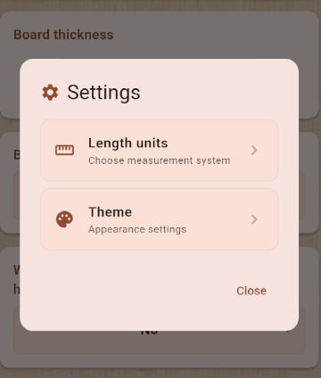
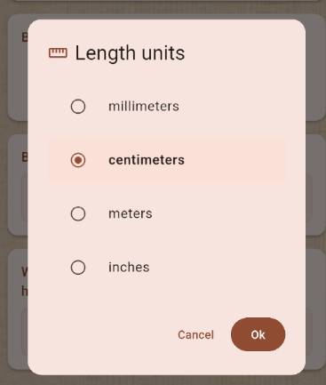
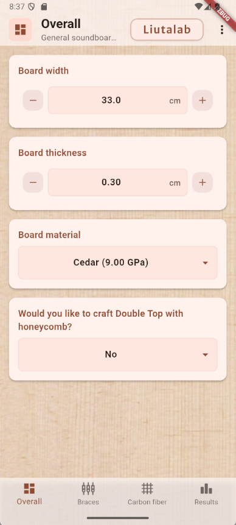
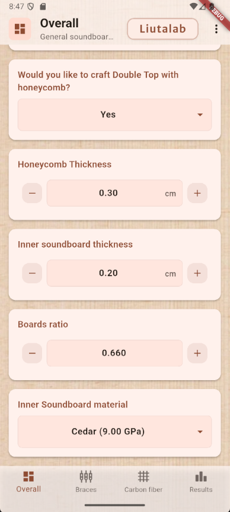
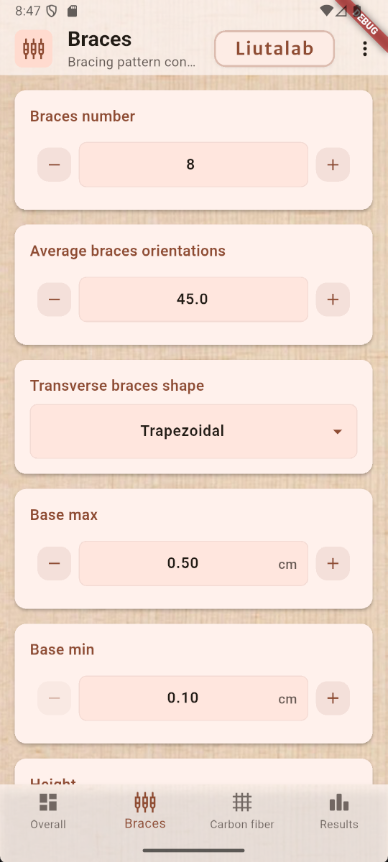
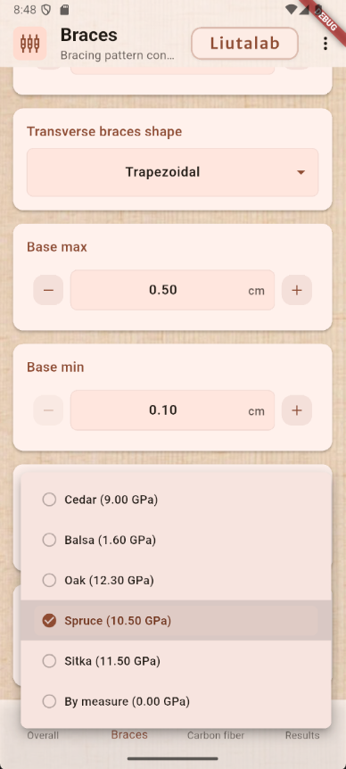
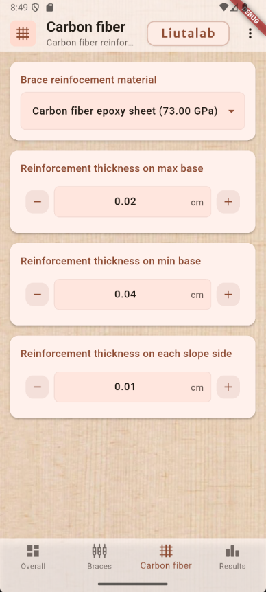
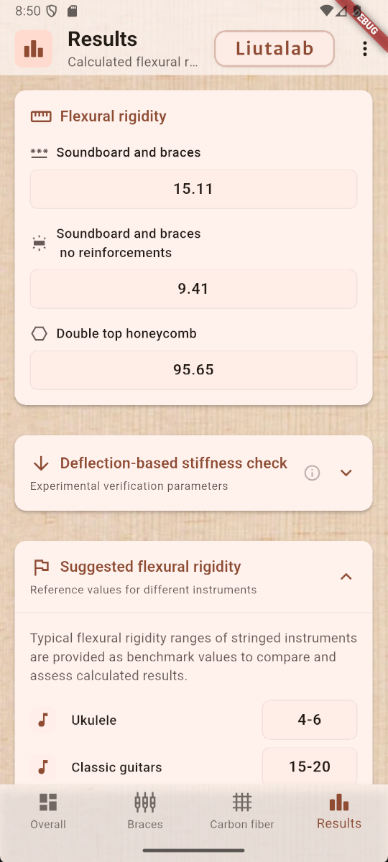
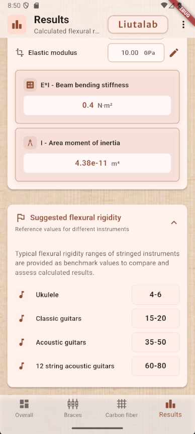

# Liutalab - Manuale d'uso

## Introduzione

L'app che stai utilizzando ha lo scopo di definire correttamente dimensioni, forma e numero di catene, ovverosia dei rinforzi incollati sotto la tavola armonica della chitarra, oltre allo spessore della stessa tavola armonica considerando i legni utilizzati ed eventuali rinforzi in fibra di carbonio o altri materiali.

All'interno di Liutalab troverai, oltre alla parte relativa alla progettazione delle parti che compongono la soundboard anche una parte dedicata alla verifica strumentale della stessa prima di essere incollata alle fasce, verifica che permette di effettuare gli ultimi ritocchi sulle catene strutturali della soundboard.

Nel testo che segue spesso si utilizzerà il nome chitarra per descrivere lo strumento deputato all'uso di questo applicativo, considera questa semplificazione un modo per identificare tutti quegli strumenti a corda che assomigliano strutturalmente ad una chitarra e che possono rientrare nei parametri di progetto e verifica utilizzati in Liutalab, di fatto strumenti acustici con piano armonico piatto e corde in tensione.

---

## Cenni di statica dello strumento

Prima di descrivere nel dettaglio le varie parti del programma di dimensionamento e verifica della soundboard faremo un ripasso di alcune questioni relative alla statica dello strumento chitarra in relazione alle tensioni meccaniche che le corde impartiscono alla struttura dello strumento e in particolare alla soundboard.

Esistono principalmente due tipi di chitarra: chitarra acustica con corde in metallo e chitarra classica con corde di nylon.

Le due, dal punto di vista delle tensioni meccaniche dovute alla diversa tipologia di materiale delle corde e al loro spessore, sono sottoposte a sollecitazioni che sono dell'ordine di 25-35kgf nel caso di chitarre classiche e 40-80kgf per le acustiche.

Nel caso di ukulele o altri strumenti specifici diversi da chitarre classiche o acustiche, prima di procedere al dimensionamento della soundboard bisogna evincere (dal numero di corde, dal materiale oltre che dalla lunghezza del diapason) il carico di sollecitazione sulla soundboard dello strumento in fase di progettazione.

Nell'ottica di una progettazione calata sulle caratteristiche proprie dello strumento, si evince la necessità di definire dei numeri di riferimento sulla base dei quali risalire alle dimensioni più corrette dell'insieme catene-tavola armonica.

Come è noto, la resistenza meccanica di qualsiasi struttura tensionata dipende dalle caratteristiche geometriche della sezione sottoposta allo sforzo e alle caratteristiche meccaniche dei materiali di cui è composta la struttura (oltre alla tipologia di tensione, nel nostro caso statica).

La chitarra in particolare non deve collassare sotto il carico delle corde ma al tempo stesso deve avere una massa mobile dell'insieme tavola-catene la più bassa possibile, in quanto la tavola armonica vibra, e vibrando produce il suono, e tanto più leggera e mobile è, tanto più forte e bene suona.

Le due grandezze che definiscono le proprietà strutturali di qualsiasi oggetto meccanicamente sollecitato sono il modulo di elasticità "E" (o modulo di Young) e il momento di inerzia di area "I".

Queste due grandezze, esprimibili attraverso numeri e unità di misura specifiche, vengono mescolate assieme attraverso il loro prodotto chiamato "E*I" rigidezza flessionale o flexural rigidity che è il nostro riferimento più importante nel dimensionamento della soundboard.

Riguardo le varie tipologie di incatenatura per chitarra classica e acustica e ai vari schemi di supporto della tavola armonica (vented, Xbracing, falcate, lattice, double top, V bracing, etc...) al di là del colore del suono che ogni tipologia di incatenatura imprime allo strumento e ponendoci solo sul piano del corretto dimensionamento della tavola armonica (soundboard), esiste un criterio di dimensionamento, frutto di prove e comparazioni dei massimi esperti del settore, nel quale emerge in particolare che la condizione staticamente migliore per l'acustica dello strumento è avere una rotazione del ponte sulla tavola armonica di circa 1,5-2° in avanti sotto l'azione di trazione delle corde.

Per giungere a questa condizione si è visto che la cosiddetta flexural rigidity (E*I) della soundboard dovrebbe essere di circa 15 per quanto riguarda le chitarre classiche e 50 per le chitarre acustiche e comunque avere un valore proporzionato al carico strutturale dovuto alle corde a seconda dello strumento che si decide di realizzare.

Lo scopo di Liutalab, l'applicazione per smartphone che andrai ad utilizzare, è infatti il corretto dimensionamento della tavola armonica in merito al valore di rigidezza flessionale.

---

## Utilizzo di Liutalab

Il programma è strutturato su quattro sottomenu: Overall, Braces, Carbon fiber, Results.

I primi tre menù definiscono le variabili necessarie al calcolo del valore E*I.

In pratica sulla base del risultato finale che intendiamo raggiungere come flexural rigidity (E*I) andremo a modificare i vari valori di spessore tavole, numero di catene, dimensioni catene, materiali, etc..., in modo da raggiungere il valore obiettivo.

Si conviene che questo strumento di aiuto al liutaio deve essere utilizzato con criterio, consapevoli che i dati da inserire siano in linea con la buona pratica del mestiere.

Si sottolinea inoltre di fare attenzione alle unità di misura utilizzate che potete impostarle in metri, centimetri, millimetri o pollici.

Al fine di sfruttare appieno le potenzialità di Liutalab e di ottenere dei dati attendibili riguardo le misure della soundboard (sulla base della E*I obiettivo) consigliamo di attenersi a quanto specificato nelle pagine seguenti del presente manuale seguendo passo passo la descrizione sul corretto utilizzo di ogni voce di menù.

Buon lavoro.

---

## Uso del manuale

### SETTINGS

Il menù si trova in ogni pagina di Liutalab cliccando sui tre punti in alto a destra.

* **Lenght units:** consigliamo di utilizzare il millimetro come unità principale di misura della lunghezza in modo da avere più precisione dopo il punto decimale.
* **Theme:** riguarda l'aspetto della grafica, chiara o scura.

 

---

### OVERALL

* **Board width:** larghezza della soundboard in mm misurata 50mm sopra il ponticello.
* **Board thickness:** spessore della tavola armonica in mm con precisione al decimo di mm.
* **Board material:** scegliendo il materiale della soundboard il programma applica il modulo elastico tabellare che trovate tra parentesi. E' possibile inserire il valore del modulo elastico "by measure" dopo averlo misurato sperimentalmente o evinto dalla certificazione del legno.
* **Would do you like to craft Double top with honeycomb?:** se si desidera calcolare anche questa tipologia di tavola cliccare sul pulsante "Yes"; diversamente, lasciate sul default "No".

Questa seconda parte di menù "overall" si attiva cliccando "Yes" alla casella "Would you like to craft Double Top with honeycomb?"

* **Honeycomb Thikness:** si consideri lo spessore in mm con precisione al decimo di mm dell'honeycomb (tipicamente in materiale aramidico) posto tra la tavola superiore (specificata nella casella "Board thikness") e la "Inner soundboard thickness" (specificata sotto).
* **Inner soundboard thikness:** è lo spessore della tavola incollata sotto la board e l'honeycomb.
* **Board ratio:** è il rapporto tra la larghezza della inner soundboard e la larghezza della board della chitarra. Tipicamente è bene impostare questo numero a un valore inferiore ad 1 anche per considerare la riduzione dello spessore dell'honeycom ai bordi.
* **Inner soundboard material:** il legno usato nella inner soundboard può essere diverso da quello usato nella board superiore. Scegliete quello del materiale utilizzato oppure inserite il valore misurato "by measure".

 

---

### BRACES

* **Braces number:** è il numero di catene che hanno uno scopo strutturale. Nel caso di Xbracing il valore è 2; nelle catene vented per chitarra classica può essere 5 o 7 a seconda della scelta costruttiva; nelle V type il numero è 2, nelle lattice dipende da quante catene intersecano il piano posto a 50mm sopra il ponticello (tipicamente 8), etc..
* **Average braces orientation:** è l'angolo di inclinazione medio delle catene rispetto alle corde. Ad es. nell'Xbracing il valore sarà circa 35-45°, nelle vented sarà circa 5-10° etc..
* **Transverse braces shape:** il programma ammette due tipologie di forma di bracing, quella trapezia e quella parabolica. In realtà la forma trapezia copre anche la forma rettangolare o quadrata come pure la triangolare, tutto dipende dalle dimensioni della base minore del trapezio.
    * **Base max (B):** è la dimensione della base della catena trapezoidale incollata sulla tavola.
    * **Base min (b):** è la dimensione della base minore del trapezio. Se questo valore è "1" allora avremmo delle catene di forma pressoché triangolare. Se il valore è uguale al valore di Base max allora avremo una sezione rettangolare o quadrata a seconda dell'altezza del trapezio.
    * **Height (H):** altezza in mm delle catene trapezie.
* **Braces Material:** in Liutalab è possibile definire il materiale delle catene che può essere diverso da quello della soundboard, questo per dare la massima flessibilità progettuale al liutaio.

---

### CARBON FIBER

In questo menù si può gestire l'eventuale aggiunta di rinforzi in fibra di carbonio, o altro materiale più resistente del legno di base, in modo da aumentare in maniera sostanziale la rigidezza flessionale senza appesantire troppo la struttura. Questi rinforzi si intendono ricavati da laminati (epoxy+fiber p.e.) di spessore calibrato (non fibre sciolte) incollate alle catene.

* **Brace reinforcement material:** nella lista si può scegliere il materiale tra quelli presenti nella lista oppure si può inserire un valore "by measure" sulla base dei dati del materiale di rinforzo rintracciabili nel datasheet del produttore.
* **Reinforcement thickness on max base:** inserire lo spessore di rinforzo applicato tra la soundboard e le basi delle catene (trapezie). Fate attenzione perchè si intende uno spessore applicato alla base di tutte le catene di larghezza pari alla base della catena trapezia.
* **Reinforcement thickness on min base:** è lo spessore di rinforzo incollato sopra la base minore del trapezio di larghezza pari alla larghezza della base minore del trapezio. Da notare come incollare lo spessore sulla base minore piuttosto che sulla base maggiore, sia una modalità decisamente più efficace per aumentare la rigidezza della struttura.
* **Reinforcement thickness on each slope side:** è lo spessore di rinforzo applicato su entrambi i bordi delle catene trapezie. Questo significa che il valore di spessore che si inserisce viene automaticamente calcolato due volte su tutte le catene.

---

### RESULTS

* **Flexural rigidity:** sono i risultati di rigidezza flessionale rispettivamente della soundboard comprensiva di catene e della soundboard di tipo double top, se si è deciso di calcolarla nel menù apposito. I numeri che si vedono sono il risultato dei calcoli ottenuti con i valori geometrici e di resistenza (E) inseriti. A seconda che il valore di El sia superiore o inferiore a quello che consideriamo corretto, per avvicinarsi il più possibile è sufficiente modificare i dati numerici inseriti (ad es. misura e numero catene, spessore tavola, materiali utilizzati, etc..). Il calcolo della rigidezza flessionale viene aggiornato automaticamente rientrando nel menù results.

**Deflection-based stiffness check:** questa sezione è particolarmente utile per la verifica strumentale della soundboard provvista di catene dopo aver calcolato e dimensionato tavola e catene. In pratica si procede appoggiando la soundboard su due supporti posti ad una certa distanza ("L" span lenght), applicando un precarico e un carico (load applied) nel centro della tavola e misurando la deflessione (measured deflection) sotto al carico secondo lo schema riportato in figura. Il numero risultante è il valore di rigidezza flessionale. Se questo numero è superiore al valore obiettivo si andrà a ridurre la sezione delle catene strutturali fino a raggiungere il dato desiderato, se è invece inferiore bisognerà aggiungere dei rinforzi ulteriori alla soundboard.

* **Suggested flexural rigidity:** Quelli indicati sono numeri di riferimento che si utilizzeranno a seconda dello strumento che si andrà a progettare. Sottolineiamo che non esiste un numero corretto di rigidezza specifico per ogni strumento perché questo numero potrebbe variare a seconda dello spessore delle corde utilizzate.

